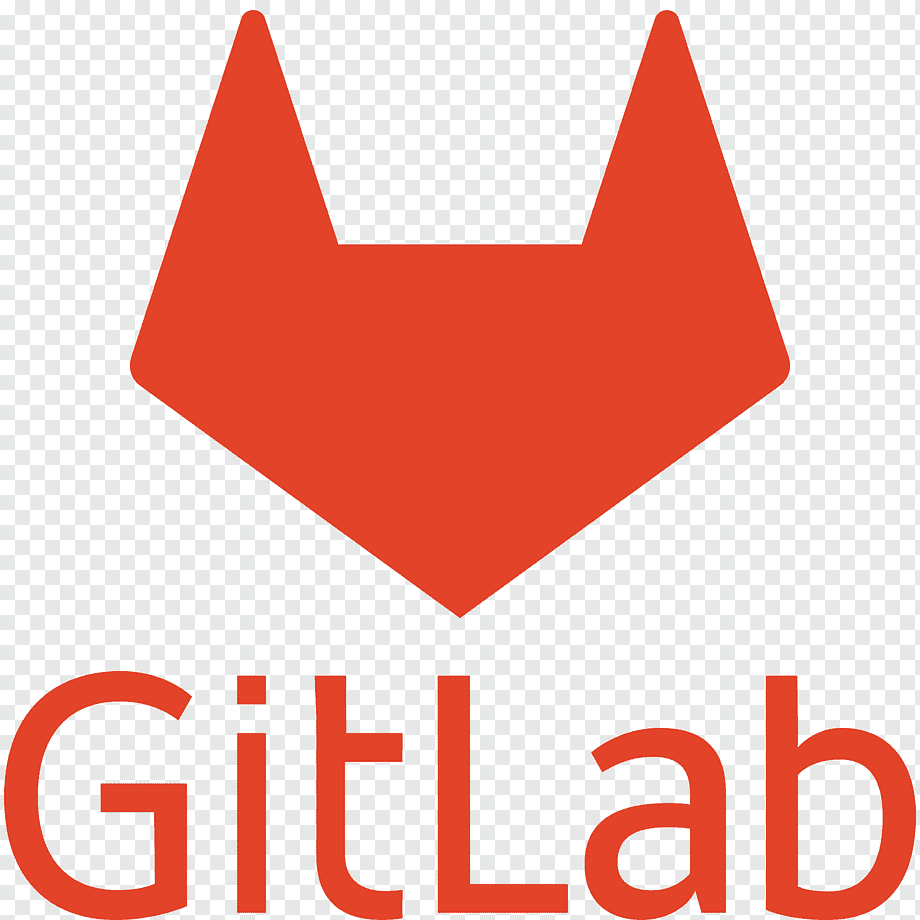

 

## 👩‍💻About me
- I'm manual and automation Engineer.
- I work QA about 2 years.
- I write autotests in Python
- Email: signacher@mail.ru
- Telegram:@Aleksey_Telnov

  &#8287;&#8287;&#8287;&#8287;&#8287;
  
  &#8287;

### 🛠️ Stack and tools:

  <code></code>
  <code></code>
  <code></code>
  <code></code>
  <code></code>
  <code></code>
  <code></code>
  <code></code>
  <code></code>
  <code></code>
  <code></code>
  <code></code>
  <code></code>
  <code></code>
  <code></code>
  <code></code>
  <code></code>

