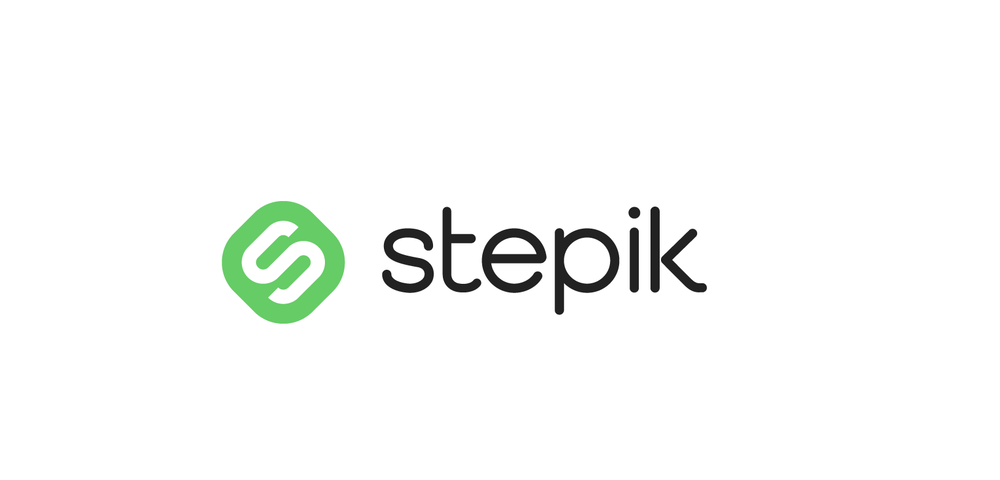

 

## 👩‍💻Обо мне
Меня зовут Алексей, я QA Engineer из Ростова-на-Дону.
- :heavy_check_mark: У меня более 2-х лет опыта в QA, из них год в автотестировании.
- :pencil2: Пишу автотесты на языке Python
- :open_file_folder: [Примеры проектов](#open_file_folder-Примеры-проектов)

---

  ## :telephone_receiver:Мои контакты
- :mailbox_with_mail: Email: signacher@mail.ru

  &#8287;&#8287;&#8287;&#8287;&#8287;
  
  
  &#8287;

---

## 🛠️ Языки и инструменты:

  &nbsp;
  &nbsp;
  &nbsp;
  &nbsp;
  &nbsp;
  &nbsp;
  &nbsp;
  &nbsp;
  &nbsp;
  &nbsp;
  &nbsp;
  &nbsp;
  &nbsp;
  &nbsp;
  &nbsp;
  &nbsp;
  &nbsp;
  &nbsp;

---

## :open_file_folder: Примеры проектов
###  [UI тесты для онлайн магазина saucedemo.com](https://github.com/signacher/Saucedemo_UI)
- Тесты написаны на языке `Python` с помощью библиотеки `Selenium`
- Тесты запускаются в Headless режиме с помошью `Github Actions`.
- Пишется лог в файл расположенный в папке logs
- `Allure отчет` о результатах прохождения тестов с историей запусков публикуется в `Github Pages` [Отчет](https://signacher.github.io/saucedemo_ui)
  
---

 :man_student: Курсы

   <table width="100%" border='0'>
    <tr><td width="30%" valign="bottom"></td><td valign="middle">Школа инженеров по автоматизации тестирования <a target="_blank" href="https://qa.guru">QA.GURU</a> - Инженер по автоматизации тестирования на Python </td>
    </tr>
    <tr><td width="30%" valign="bottom"></td><td valign="middle"> <a target="_blank" href="https://www.software-testing.ru/edu/3-online/242-selenium-webdriver/">Selenium WebDriver: полное руководство</a>.</td></tr>
    <tr><td width="30%" valign="bottom"></td><td valign="middle"> <a target="_blank" href="https://www.learnqa.ru/python_api">Автоматизация тестирования REST API на Python</a>.</td></tr>
    </tr>
    <tr><td width="30%" valign="bottom"></td><td valign="middle"> <a target="_blank" href="https://skyeng.ru/">Skyeng</a>.</td></tr>
   </table>

 
